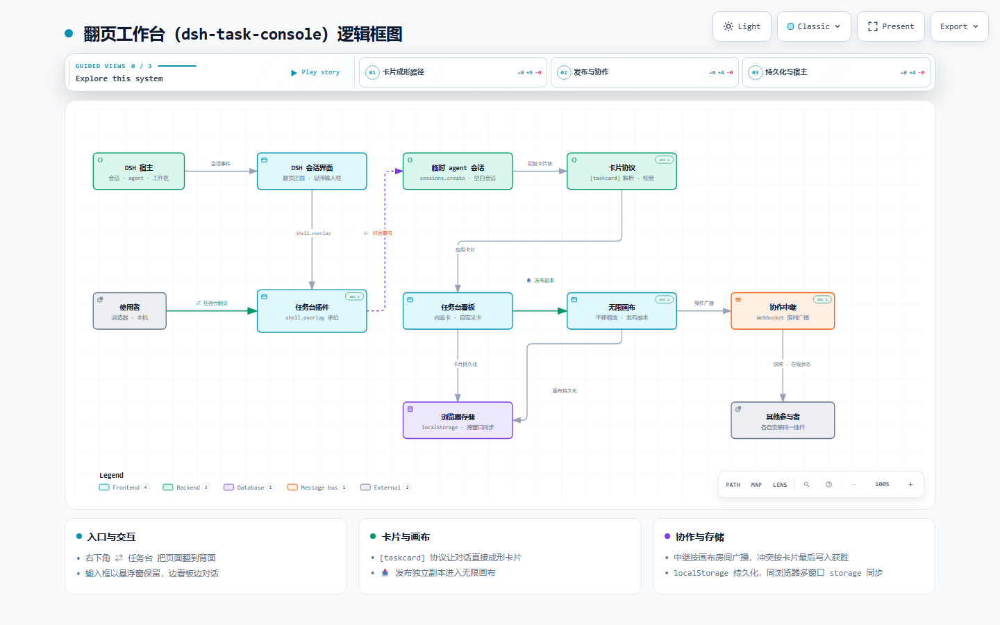

# dsh-task-console
[](https://dsh-plugin.org/plugins/he2way/dsh-task-console)
[](https://www.npmjs.com/package/dsh-task-console)
[](https://www.npmjs.com/package/dsh-task-console)
[](LICENSE)
[](https://github.com/awesome-dsh-plugin/awesome-dsh-plugin)

A [DeepSeek Harness (DSH)](https://github.com/deepseek-ai/deepseek-harness) client plugin: a floating glass **task console** for the current session. Click the glass button in the bottom-right corner and the page "flips" to its back — a frosted-glass board with mouse-draggable cards showing live background jobs, subagents, a session overview and the workspace.

一个 DeepSeek Harness (DSH) 客户端插件：为当前会话提供悬浮毛玻璃「任务控制台」。点击右下角的玻璃按钮，页面翻到背面 —— 一块毛玻璃面板上悬浮着可鼠标拖拽的卡片，实时展示后台任务、子代理、会话概览与工作区。

## Features / 功能

- **Flip to the back / 一体两面翻面** — a floating glass toggle (`⇄ 任务台`, fixed bottom-right) flips the whole main interface over around the page's vertical center axis: the real session page is the front face (it visibly turns away) and the frosted-glass task board is the back face (it turns into view) — one body, two faces. A silky ease-in-out 180° flip with no end wobble; a light sheen glides across the glass and the cards rise in staggered as the board lands; closing flips the page back. Respects `prefers-reduced-motion`; `返回会话` or `Esc` flips back.
- **Floating composer / 统一悬浮窗** — the REAL conversation input bar stays put while the page flips: its seat (`[data-composer-seat]`) is switched to fixed positioning (never moved out of `#root`), so typing, attaching and sending keep working over the task board. As the page turns, the input bar **morphs** into the floating window (grows from the visible input card, glass fades in); on close it **morphs smoothly back** to the same spot (title bar and transcript come off first so the shrinking box never clips). The home rect is the **visible box** — the input card (plus its padding) for a live conversation, the hero stack for the new-session welcome — never the seat's full-column box, so the window never stretches wide and the final restore lands on the identical box: no snap, no fade-out. The new-session welcome **reverts smoothly** on close too — the compact title grows back, the glow fades in and the layout settles via transitions. The chat scrollport is put into smooth-behavior mode around the restore and its pre-flip state is remembered, so every programmatic scroll — including the chat view's own pinned-follow — glides the history into place instead of jumping when the composer re-enters the flow. Both the active conversation and the new-session welcome open as **one unified water-glass floating window** with the same initial size (440×480): a title bar on top, the brief live transcript (last few messages, role chip + truncated text, refreshed as you chat), and the real input with its full option bar (permission config, command menu, model seat, context meter) at the bottom. The window is **draggable** by its top bar and **resizable** by its bottom-right corner (320–viewport limits). The new-session window shows its welcome title header, workspace chip and input instead of the transcript. While the board is open, body-level portaled menus (workspace picker, command menu, …) are lifted above the board so every button stays clickable.
- **Live current-session data / 当前会话实时数据**（来自 DSH 的 `useSessions` 标准数据源）:
  - **会话概览 Session** — title, running/idle, phase, origin, live job & subagent counts.
  - **后台任务 Jobs** — live background jobs: status dot, kind chip, label, status, ticking durations (live jobs first).
  - **子代理 Subagents** — the session's subagent catalog: child/fork, running/idle, id.
  - **工作区 Workspace** — cwd, session id, last update time.
  - **插件管理 Plugins** — the frame-wide dynamic Cordis inventory: each plugin's name, running/stopped state, and actions (停止 / 移除 with a two-step confirm), refreshed automatically on the dynamic-plugin events (`cordis/dynamic-package`, retract, run requests).
- **Draggable & resizable glassmorphism cards / 可拖拽、可缩放毛玻璃卡片** — hold a card header and drag (pointer capture, clamped to the board); the grabbed card is raised by direct DOM z-order while dragging, and **drag the bottom-right corner to resize any card** (220–900px wide, 120–1200px tall, clamped to the board); every card can be collapsed (`▴/▾`) or opened **fullscreen** (`⛶`); user cards can be pinned on top (`📌`); built-in cards can be hidden (`×`); positions, sizes and state persist in `localStorage` (`dsh.taskconsole.v1`); `复位卡片` restores the built-in layout while keeping your user cards. Gestures are **compositor-driven and render-free while the pointer is down**: pointer moves apply a transform (or an inline size) inside a `requestAnimationFrame`, the moved card drops its `backdrop-filter` for the duration (every other card keeps its normal look), grabbing no longer triggers a board re-render, and React state + `localStorage` are committed exactly once on release. Card bodies are memoized, and once the flip settles the rotated front face is culled (`visibility` + `content-visibility: hidden`) so the compositor only handles the board.
- **Infinite canvas & live collaboration / 无限画布与多人协作** — `🖼 画布` in the board header opens a **fullscreen infinite canvas** (wheel zoom anchored at the pointer, drag empty space to pan, `复位视图` to recenter); any user card publishes an independent copy onto it with `📤`. Canvas cards move/resize freely and keep the whole pipeline: control blocks, widget state, `✎` manual editing and `💬` agent refactor. Images can be dropped or pasted onto the canvas (downscaled to a bounded JPEG and stored as an `image` control). Canvases are named, switchable and kept per browser (`dsh.taskconsole.canvas.v1`); `复制分享串` emits a `DSHCANVAS1:…` string carrying the relay URL + canvas id + optional token, and `协作 → 加入` adopts it. Multi-user editing runs over the **zero-dependency relay shipped in [`relay/server.mjs`](./relay/server.mjs)** (`node relay/server.mjs --port 8787 --token <secret>`): a joiner receives the room snapshot, every card mutation is broadcast, presence is shown in the canvas bar, and conflicts resolve **last-writer-wins per card** (`updatedAt`, then `rev`). See [infinite canvas & collaboration](#infinite-canvas--collaboration--无限画布与多人协作).
- **Preset card: 工作时序 / 预设卡「工作时序」** — the board's sixth built-in card hosts the **dsh-plugin-tpt-chronicle** panel (装置对象 / 工作脉络 / 材料证据 / 使用足迹, with its 同步数据 action). It is the one built-in card that renders **another plugin's** UI: the card asks the TPT client bundle to mount itself into a node the card owns (`mountEmbedded(node, { render, dark, onStatus })`), so the panel keeps its own DOM, stylesheet and `/tpt-chronicle/api/*` access — no iframe, no second React copy, and every panel button keeps working. The bundle is loaded once per page from its own boot row (`window.__DSH_BOOT__.entries`), and when the plugin is missing the card says so and points at `dsh plugin --profile web add …`. Everything else is a normal built-in card: drag, resize (384×330 default), `⛶` fullscreen (the panel's side nav appears there), collapse, hide, reset, persisted layout — plus the board's dark theme reaches the panel (`data-embed-dark` on the host) and the header badge shows the material count the panel reports.
- **User cards you add / edit / delete / 自定义悬浮卡片（新建 / 编辑 / 置顶 / 删除）** — the board header's `+ 新建卡片` creates a blank draft card and **auto-opens the conversation popup at the top-right**, where you describe the card's style and internal controls in language and the assistant shapes it; `✎` still offers manual editing of text + buttons + embedded apps; each user card carries `📌` 置顶 / `⛶` 最大化进副本画布 / `📤` 发布为副本 / `💬` 对话修改 / `✎` 编辑 / `🗑` 删除（两次点击确认）; the six built-in cards (session/jobs/subagents/workspace/plugins/chronicle) stay read-only. Cards, positions, styles and states survive reloads in `localStorage`.
- **Cards authored in the conversation / 对话生成卡片（内容高度自由）** — no copy/paste needed: while you chat (in the floating main-session window over the board, or in any conversation), an assistant/user message that contains a `[taskcard]…[/taskcard]` block is watched live and applied to the board (create / update / delete). The AI decides the card's content freely and picks the right **controls** for the need — text, headings, notes, stats, progress, trends, key-values, tables, code, links, tags, images, checklists, counters, toggles, countdowns, bar charts, action buttons and **embedded web apps** — see [the card protocol](#user-cards--the-taskcard-protocol--自定义悬浮卡片与卡片协议).
- **Associate other web apps with a card / 卡片关联内嵌网页应用** — a card can host other web applications as sandboxed frames: the manual editor (`✎`) has an **内嵌网页应用** section (address, name, height, 填满卡片, test-open ↗) and a conversation can author the same thing with an `embed` control (`{ "kind": "embed", "url": "http://localhost:5173", "title": "本地应用", "fill": true }`). Only absolute `http(s)` URLs are accepted — `javascript:`, `data:`, `file:` and `blob:` never reach the frame; the URL is normalized through `new URL()`. **Drag the app's bottom edge to size it**: the frame follows your pointer (the live pixel value is shown while dragging) and the height is committed once on release — measured in layout pixels, so it stays exact even inside the zoomed infinite canvas. Each app also gets a small bar with reload (`↻`), open-in-new-tab (`↗`) and copy-address (`⧉`); `fill: true` makes the app take the card's remaining height instead (resize the card itself), so one card can be a whole app window — or mix an app with notes, buttons and other controls (up to 4 apps per card). Frames are sandboxed **without** `allow-top-navigation` (an embedded app can never navigate the workbench away), and a **same-origin** address (this GUI itself) is re-framed with an opaque origin so the embedded copy cannot script the workbench. Apps keep their own cookies/storage/logins and run their own JS; sites that refuse framing (`X-Frame-Options`/CSP) show blank — use `↗`. Embeds travel with the card when it is published to the canvas.
- **Refactor a card by talking / 💬 对话重构卡片** — every user card carries a `💬` button (and `+ 新建卡片` auto-opens it) with a top-right conversation popup: describe the change in natural language and send. The plugin **calls a temporary agent session**, streams that agent's reply into the popup, parses its `[taskcard]` block and applies it to the card (including deletion); the helper session is archived afterwards and the main conversation is left untouched. The helper is a **fresh blank session** created in the source session's workspace (or cwd), so it inherits neither that conversation's history nor its agent inbox; `session.fork` remains only as a fallback when `create` is unavailable, and that path drops inherited queue items and stops a stale inherited turn before prompting. The reply is read from the helper session's own **event window** (durable `assistant/message` events plus its streaming rows) — session snapshots carry lifecycle state only — and only after the instruction itself shows up there as a user message. If the agent services are unavailable it falls back to sending through the current main session, and the popup says why.
- **Right-hand architecture diagram / 右侧项目逻辑框图** — `🗺 框图` in the board header docks the project's own architecture diagram against the right edge of the board (drag the left edge to change its width; the width is remembered). The diagram is an **archify artifact** ([`docs/architecture.html`](./docs/architecture.html), generated from [`docs/architecture.json`](./docs/architecture.json)) that ships **inside the client bundle** — gzipped + base64 (`tools/embed-diagram.mjs`), decompressed on first open with `DecompressionStream` and rendered in a sandboxed `iframe` (`srcdoc`), so there is no extra file or network request. Inside the dock the diagram stays fully interactive (zoom, click nodes, light/dark, export); `新标签打开` opens the same artifact full-screen in a new tab. See [architecture diagram](#architecture-diagram--右侧项目逻辑框图).
- **A card's controls live on its own canvas / 卡片的控件就在它自己的画布上** — maximizing a user card (`⛶`) **unrolls it into its controls**: every control becomes its own canvas item, two readable columns deep, each one draggable, resizable, editable (`✎`), refactorable by talking (`💬`), openable fullscreen (`⛶`), duplicable (`⧉`), sendable to the board (`📥`) and deletable. The **board card is their thumbnail** — it renders the same controls compactly with a `N 个控件 · ⛶ 进画布排布` line, and **rearranging items on the plane re-orders the controls on the card** (order = `y`, then `x`), so the card is a live miniature of the canvas. Controls carry a stable `bid`, so editing an item writes that control back onto the card and deleting an item removes the control from the card. **A conversation refactor of the card targets exactly the controls the canvas holds**: after the agent (`💬`, `[taskcard]`) or the editor (`✎`) changes the card, the plane is reconciled with it — removed controls lose their item, surviving controls keep their position/size and take the new content and label (the refactor prompt tells the agent to echo existing `bid`s and widget `key`s), and added controls get a fresh item underneath; deleting the card clears its items instead of leaving ghost controls. `⟲ 重新展开控件` re-unrolls the card's current controls, `⟲ 放入源卡副本` still adds a whole-card copy, and derived/duplicated items stay unbound. The instance canvas is created on first use and reused afterwards (`cv-inst-<cardId>`, named `副本 · <title>`), keeps its arrangement, stays out of the normal canvas list, and is a normal canvas underneath — share strings and relay collaboration work there too. Built-in read-only cards keep the plain fullscreen view.
- **Fullscreen any card / 卡片可以全屏** — built-in cards (and any card opened from inside a canvas instance) have a `⛶` button that shows them **fullscreen over the whole workbench**: the same body, rendered big (up to 1680×1200). The header keeps the card's actions (pin / publish / refactor / edit) and `⤢` asks the browser for real fullscreen (hidden browser chrome; Esc then belongs to the browser first); `Esc`, the backdrop or `✕` closes the view — while something else is layered above the canvas, that first Escape closes only the overlay. It is a labelled dialog (`role="dialog"`, `aria-modal="true"`).
- **Theme aware / 明暗主题自适应** — follows the DSH theme (`data-ds-dark-theme`), respects `prefers-reduced-motion`.

## Install / 安装

Requires a DSH profile (default: `web`). The package declares `dsh.bundle`, so `dsh plugin` wires it into the profile's bundle list automatically — no manual patch editing.

需要 DSH profile（默认 `web`）。本包声明了 `dsh.bundle`，`dsh plugin` 会自动把它加入 profile 的 bundle 列表，无需手动改 patch。

### From the plugin market / 从插件市场安装

Listed in the community DSH plugin markets ([awesome-dsh-plugin](https://github.com/awesome-dsh-plugin/awesome-dsh-plugin) → [dsh-market](https://github.com/dsh-market/dsh-market), [dsh-plugin-market](https://github.com/NanmiCoder/dsh-plugin-market)) as **`He2way/dsh-task-console`**, category **ui**. Install the market, then either one-click install there or use the command below.

已收录进社区插件市场（`awesome-dsh-plugin` 及其下游市场）条目 **`He2way/dsh-task-console`**，分类 **ui**。装上市场后可在里面一键安装，或直接用下面的命令。

### From npm / 从 npm 安装

Published as [`dsh-task-console`](https://www.npmjs.com/package/dsh-task-console) (23 files, ~1.7 MB tarball, no build step):

```bash
dsh plugin --profile web add dsh-task-console
```

### From a GitHub release tarball / 从 GitHub Release 的 tarball 安装

```bash
dsh plugin --profile web add https://github.com/He2way/dsh-task-console/releases/latest/download/dsh-task-console.tgz
```

### From GitHub / 从 GitHub 安装

```bash
dsh plugin --profile web add git+https://github.com/He2way/dsh-task-console.git
```

> If pnpm blocks the build of a git-hosted dependency, add the exact key pnpm prints under `allowBuilds` in `$DSH_HOME/profiles/web/pnpm-workspace.yaml`, then re-run.
> 若 pnpm 阻止 git 依赖的构建，把 pnpm 打印的 key 加到 `$DSH_HOME/profiles/web/pnpm-workspace.yaml` 的 `allowBuilds` 下，再重跑一次。

Then restart the `dsh web` process (or reload the profile) so the new loader row mounts and the browser bundle is composed into `window.__DSH_BOOT__`. Hard-refresh the page (Ctrl+Shift+R).

然后重启 `dsh web` 进程（或重新加载 profile）使新 loader 行挂载、浏览器 bundle 进入启动清单，最后强制刷新页面（Ctrl+Shift+R）。

## Usage / 用法

1. Click the floating glass button `⇄ 任务台` (bottom-right).
2. The page flips to the back — the glass task console for the current session. The button stays at the bottom-right, so click it again (now `◀ 返回正面`) to flip straight back; the conversation input bar also stays put at the bottom, so you can keep typing and sending while the board is open.
3. Drag cards by their headers; **drag a card's bottom-right corner** to resize it (the size sticks and is remembered per card); `▴/▾` collapses a card, `×` hides a built-in card. Built-in cards are read-only.
4. `+ 新建卡片` creates a blank draft card and **auto-opens the agent conversation popup at the top-right** — describe the style and the internal controls you want (e.g. “周报样式，蓝色强调、宽卡片，加一个完成清单和复制按钮”), send, and a temporary agent session refactors the card from your description. On a user card use `📌` (pin), `📤` (publish a copy to the canvas), `💬` (对话重构), `✎` (edit), `🗑` (delete — click twice).
5. `🖼 画布` opens the infinite canvas: publish copies, arrange them freely, drop images, then `复制分享串` and hand the string to someone else (they paste it under `协作 → 加入`) to edit the same canvas together — see [infinite canvas & collaboration](#infinite-canvas--collaboration--无限画布与多人协作).
6. `复位卡片` restores the built-in layout (your user cards are kept); `返回会话` / `Esc` also flip back to the chat.

## User cards & the [taskcard] protocol / 自定义悬浮卡片与卡片协议

A **user card** is authored by any conversation message: the board watches the chat, recognizes a settled `[taskcard]…[/taskcard]` block and applies it live — no refresh, no copy/paste. Applied blocks are deduplicated by content, and history never re-fires after a reload.

用法：让会话中的 AI（或你自己）在消息里输出下面这种块即可：

```text
[taskcard]
{
  "title": "发布清单",
  "blocks": [
    { "kind": "heading", "text": "发版前" },
    { "kind": "checklist", "key": "todo", "items": [
      { "id": "test", "label": "跑完测试" },
      { "id": "doc",  "label": "更新 README" }
    ] },
    { "kind": "progress", "label": "进度", "value": 2, "max": 3, "unit": "步" },
    { "kind": "stats", "items": [ { "label": "通过", "value": "42" }, { "label": "失败", "value": "0" } ] },
    { "kind": "links", "items": [ { "label": "流水线", "url": "https://github.com/…/actions" } ] },
    { "kind": "kv", "rows": [ [ "分支", "main" ], [ "版本", "0.3.0" ] ] },
    { "kind": "button", "action": "fill", "label": "填入发布命令", "value": "dsh run deploy" }
  ]
}
[/taskcard]
```

卡片内容 = 一组「控件」（`blocks`）。控件类型由 AI 按对话需求自由选择、自由组合；交互控件的状态（勾选、计数）随卡片持久化，刷新不丢。

控件目录（v1.3）：

| kind | 作用 | 关键字段 |
| --- | --- | --- |
| `text` | 正文段落（支持换行） | `text` |
| `heading` | 小标题 | `text` |
| `note` | 灰底说明条 | `text` |
| `stats` | 大数字统计块 | `items: [{ label, value }]` |
| `progress` | 进度条 | `label`, `value`, `max`, `unit?` |
| `trend` | 趋势图（折线+面积，随卡片 accent 着色） | `values: [数字…]` 或 `points: [{ label?, value }]`（≥2 点，≤48），`label?`, `unit?` |
| `kv` | 键值对行 | `rows: [[k, v], …]`（也接受 `items: [{ key\|label, value }]`） |
| `links` | 链接列表（仅 http/https） | `items: [{ label, url }]` |
| `chips` | 标签胶囊 | `items: ["a", "b"]` |
| `image` | 图片（`https`/`http` 或 `data:image/*`，data URL ≤700KB） | `src`, `caption?`, `alt?` |
| `embed` | 内嵌其它网页应用（沙箱 iframe，下边缘可拖动改高度） | `url`（仅 http/https）, `title?`, `height?`(120–1200，可拖动), `fill?` |
| `checklist` | 复选清单（勾选持久化） | `key`, `items: [{ id, label }]` |
| `counter` | 计数器（± 步进、持久化） | `key`, `label`, `step?`, `min?`, `max?` |
| `button` | 动作按钮 | `label`, `action`, `value` |
| `table` | 表格（列多时横向滚动） | `columns: [表头…]`, `rows: [[单元格…]]` |
| `code` | 代码块（带复制按钮） | `language?`, `text` |
| `toggle` | 开关（状态持久化） | `key`, `label`, `value?` |
| `countdown` | 倒计时（每秒刷新，到点显示 `done`） | `label?`, `until`（ISO 时间或毫秒时间戳）, `done?` |
| `bars` | 条形占比图 | `label?`, `items: [{ label, value }]` |

整体样式 `style`（可选，想改再给；只给要改的字段，不给则保留当前样式）：

| 字段 | 取值 |
| --- | --- |
| `accent` | 顶部强调色：`indigo` / `blue` / `sky` / `emerald` / `amber` / `rose` / `violet` |
| `width` | 卡片宽度：`compact`(260px) / `standard`(300px) / `wide`(420px) |
| `density` | 内容密度：`compact` / `cozy` |
| `icon` | 标题前的头部小图标（emoji / 文字，最多 6 个字符） |

按钮 `action` 取值：

- `copy` — 把 `value` 复制到剪贴板（按钮闪现「已复制」）。
- `link` — 新标签页打开 `value`（必须是 http/https）。
- `fill` — 把 `value` 填入主会话输入框（不发送，你确认后回车发送）；输入框不可用时会退回复制。

规则 / Notes：

- 内嵌网页应用（`embed`）把别的网页应用放进卡片：`url` 必须是 `http://` 或 `https://` 开头的完整地址（例：`https://example.com/app`、`http://localhost:5173`），其它协议（`javascript:` / `data:` / `file:` / `blob:`）一律丢弃；`height` 是像素高度（120–1200，默认 300，**可以直接拖动应用下边缘改**，拖动中显示当前像素值，松手保存），`fill: true` 让应用铺满卡片剩余高度（改高度用卡片右下角手柄）。一张卡片最多 4 个 `embed`，并且可以和 `text` / `button` 等控件混排；卡片上的 ↻ 重新加载、↗ 在新标签打开、⧉ 复制地址。若某个站点禁止被嵌入（`X-Frame-Options` / CSP），画面会空白 —— 这是站点的限制，用 ↗ 打开即可。
- 交互控件（`checklist` / `counter`）建议带 `key`（稳定 id，`[A-Za-z0-9._:-]{1,64}`），交互状态按 `key` 保存；没有 `key` 时退化为按控件位置保存，改动控件顺序后勾选/计数值可能丢失。
- 再次 upsert 同一张卡片会替换它的控件列表，同时保留仍然存在的 `key` 对应的交互状态（被删掉的 `key` 会清理）。
- `id`（卡片 id）可选且稳定；省略则随机 `usr-…`，或用 `title` 精确匹配更新。`upsert` 为默认操作（不带 `op` 即是）：新建卡片，或更新同 `id` / 同 `title` 的卡片（更新会取消隐藏并刷新内容）。
- remove — `{ "op": "delete", "title": "…" }` 或 `{ "op": "delete", "id": "…" }`。
- 旧格式兼容：不带 `blocks` 的 `body` / `buttons` 字段会被自动映射成 `text` / `button` 控件，v0.2 的写法照常可用。
- 未知控件类型不会丢失：卡片上会显示「未支持的控件：xxx（可用：…）」提示，并把该控件保留的原始字段以键值行展示出来；后续版本支持该 kind 时旧卡会自动升级还原。需要全新控件类型时，直接告诉会话里的 AI（或改 `lib/client.js` 的 `sanitizeTaskBlock` / `TaskBlockView` 增加一个 kind）即可——控件目录就是这段代码里的 `TASK_BLOCK_KINDS`。
- 已知控件写错字段会被丢弃（例如 `kv` 写成 `items: [{ key, value }]` 在 0.8.2 之前会整块消失，现在这种写法被接受；`stats` 仍需 `items: [{ label, value }]`）。对话重构的提示词里已经列出各 kind 的字段名，AI 按提示词书写即可；自己手写 `[taskcard]` 时请对照上面的字段表。
- 上限：每张卡 ≤16 个控件；文本 ≤4000、按钮值 ≤1024；清单 ≤24 项；progress/counter 数值 ≤1e6；trend 2–48 个点；`links` / `chips` / `kv` / `stats` 每类 ≤12 / 12 / 12 / 8 项。
- 只应用「已稳定」的消息（约 1 秒不再变化），流式中间片段不会产生半张卡片；内容哈希去重，刷新后历史不会重放。
- 持久化：`dsh.taskconsole.v1`（卡片与布局）、`dsh.taskconsole.specs.v1`（已应用的块哈希）。

> 手动编辑浮窗（✎）只编辑「文本 + 按钮」；AI 生成的 heading / checklist / progress 等其它控件与卡片样式保存时会原样保留。真正「任意可执行控件」（控件内跑自定义逻辑）需要 DSH host 侧执行通道，属下一阶段；本目录全部控件均在浏览器内安全声明式渲染。
> 💬 对话重构：卡片头部 `💬` 或新建卡片自动弹出的对话框位于**右上角**；发送后插件会**调用一个临时 agent 会话**完成重构，弹窗内实时流式显示该 agent 的回复，解析其中的 `[taskcard]` 并应用到卡片（含删除），结束后自动 `workspace.archiveSession` 归档该临时会话——主会话记录不受影响。临时会话默认是**新建的空白会话**（落在源会话所在的 workspace / cwd），既不继承该会话的历史，也不继承它的 agent inbox，只处理卡片这一条指令；`session.fork` 只在 `create` 不可用时保留为兜底，那条路径会先清掉派生带进来的排队消息、中止已经开跑的遗留回合，再重新取基线后发指令。**为什么不用 fork 当主路径**：`session.fork` 的切点会把边界回合之后、下一个 `turn/start` 之前的散事件一起带进子会话，源会话里**还没被消费掉的排队消息**（`agent/inbox/spliced` 的 next-turn 插入）因此会变成子会话的待办并在那里先跑，插件的卡片指令只能排在它后面——实际发生过：派生出来的临时会话花了好几分钟重跑源会话的一条旧消息，压根没碰卡片。所以派生后会先检查子会话尾部是否带这类遗留待办（或已经开着回合），命中就清队列 + 取消遗留回合；同时只有确认指令已经变成子会话里的 user message 才认那份回复，否则立刻退回主会话而不是空等。回复从该会话自己的**事件窗口**读取（durable `assistant/message` + 流式增量行）——会话快照只有生命周期状态，没有消息节点。若 agent 服务不可用则退回“发送到当前主会话 + 监听应用”的方式，并在弹窗里说明原因。

## How it works / 工作原理

- The browser half registers as an occupant of the `shell.overlay` slot (the documented additive seat for a frame-wide floating surface). The overlay layer is click-through; the console opts back into pointer events only on its own surfaces.
- **One body, two faces:** the flip finds the app frame as the parent of `[data-shell-overlay]` and rotates its surfaces — the sidebar/details columns, the drag handles, the conversation header and the chat view — around the viewport center with the same `rotateY(0→180°)` inline transition the workbench card uses (identical duration/easing/perspective), each backface-hidden and pointer-inert while flipped. The frame itself is deliberately left untransformed: a transform on it would turn the composer seat's fixed positioning frame-relative and carry the input away with the page. The card and the toggle are mounted on `document.body` through React's `createPortal` (a raw DOM move out of the `#root` container would sever React's delegated events, leaving the board visible but unclickable).
- **Floating composer:** the input bar's seat (`[data-composer-seat]`) is never moved — it keeps its fixed styles (`position: fixed` at its exact rect, z-index above the workbench card), which works precisely because the frame is untransformed, and it stays inside `#root` so typing, sending and attachments keep working. Restoring simply clears the inline styles.
- **Settles flat:** once the open flip finishes, the card drops its 3D transform (`data-settled`) so the board is a plain flat full-screen layer — backface-hidden elements inside a `preserve-3d` rotated ancestor have unreliable pointer hit-testing in Chromium, and the flat settle keeps every click, drag, and button working. Closing flips back from the flat state (`rotateY(0→-180°)`).
- Session state comes from the standard `useSessions` prop the slot framework provides to every occupant.
- **Card store:** the board keeps a single module store (`cards` + stacking `order`) shared by the React panel and the conversation watcher; every write persists to `localStorage` and notifies open panels. Built-in cards always start from fresh defaults merged over the saved layout; user cards are adopted verbatim after validation.
- **Card watcher:** the board polls the live chat rows for `[taskcard]` blocks. It reads `data-chat-flow-kind` and accepts the kinds that carry message text — `user`, `steering` and the chat package's settled-assistant kind **`assistant-step`** (plus the legacy `assistant` alias). The `turn-process` controller row is deliberately skipped: it groups a whole turn, so reading it would apply one turn's text twice.
- **Temporary agent session:** the card popup creates a **blank session** (`sessions.create` targeting the source session's registered workspace, else its cwd) as the helper, so it inherits neither the conversation's history nor its agent inbox. `session.fork` is only the fallback for a host that cannot create. That fallback carries a known trap: the fork cut extends through trailing out-of-band appends up to the next `turn/start`, so a source message still sitting in the inbox (`agent/inbox/spliced` next-turn insert) is copied into the child as pending work — the child answers *that* first and the card instruction queues behind it. The plugin therefore classifies the seeded tail (unconsumed inbox insert, or an open turn) and, on the fork path, removes the inherited queue items and cancels the stale turn before prompting, re-baselining afterwards. The helper is never made current; the plugin calls its `open()` to subscribe its event window, then reads `assistant/message` events (and `assistant/live-chunk` deltas) newer than the baseline, accepting a reply only once the instruction itself has landed as a user message in that window — otherwise it degrades to the main session immediately instead of idling. The helper is archived afterwards through the `workspaces` service. Session snapshots expose lifecycle state only — they carry no `nodes`/`partial` transcript view.
- The node half is an empty `apply()` stub so the plugin appears in the host Loader (standard for pure-UI client plugins). The relay in `relay/` is a separate, optional process — the plugin itself needs no host code.

## Infinite canvas & collaboration / 无限画布与多人协作

Open it with `🖼 画布` in the board header (or publish straight from a card with `📤`).

- **Pan / zoom** — wheel zooms around the pointer (20 %–250 %), drag empty space to pan, `复位视图` recenters. The grid follows the view; the plane is a plain `transform`, so panning and zooming stay off the React render path.
- **Publish as a copy** — `📤` on a user card copies its title, control blocks and style into an **independent canvas card** placed near the current viewport (repeatable; later edits do not affect the board card).
- **Canvas cards** — drag by the header, resize from the bottom-right corner, `✎` manual edit, `💬` agent refactor, `⛶` fullscreen, `⧉` duplicate in place, `📥` send back to the task board (creates the card, or updates the one with the same title) and per-card widget state, all reusing the board pipelines.
- **The canvas has its own conversation box / 画布自带对话框** — every canvas carries a **narrow floating chat panel, centred 16px above the bottom edge** (340px, over the plane): describe the change in one sentence (“把清单和进度放到左上角，再加一个倒计时到明天 18 点”) and a temporary agent edits the canvas — adding any control or card, rewriting one, moving, removing, renaming — through a single `[canvas]` block of operations. Adding is first-class, not just rewriting: on a card's own canvas (`⛶` → 副本画布) whatever the chat newly creates is **adopted onto that card** (`canvasAdoptItems`) — the item gets a stable `bid`, is bound to the card's new control and lands in one column below the existing items, so the control survives the trip back to the board and the card's order keeps following the plane. The panel header holds `▴` (transcript) and `—` (shrink the panel into a small `💬 改画布` pill, `Esc` in the input does the same); the transcript scrolls inside the panel, so the canvas keeps its area and panning/zooming stay untouched. The agent is handed a **full inventory of the plane** (ids, card vs bare control, controls, positions) so it references what is really there, and the result is reported as `已应用：新增控件 1 · 移动 1 · 重命名画布`, with unusable operations skipped and counted instead of failing the batch.
- **Let the agent operate an embedded web app / 让 agent 操作内嵌网页** — mark an embedded app **受控** (card editor → 内嵌网页应用 → 受控) and the workbench — and therefore the agent — can really click, type, scroll and read inside it. A cross-origin iframe is opaque to its parent, so this works through the **zero-dependency page bridge shipped in [`bridge/server.mjs`](./bridge/server.mjs)**:

  ```bash
  node bridge/server.mjs --port 8790                                      # loopback only by default
  node bridge/server.mjs --token <secret> --allow example.com,*.internal  # optional gates
  ```

  The bridge proxies the target page (`/p?url=…`) and injects an agent script into it; that script reports back over a WebSocket and executes commands **inside the page's own origin**, so the plugin never gains script access it should not have. Drive it by hand from the app bar, or let the agent do it: the card and canvas prompts list the controlled apps and teach a `[page]` block —

  ```json
  [page] { "actions": [ { "action": "read" }, { "action": "type", "selector": "#q", "value": "dsh", "submit": true }, { "action": "click", "text": "搜索" } ], "then": "把第一条结果读出来" } [/page]
  ```

  — which the workbench runs after applying the reply, reports in the chat log (`点击 #buy ✓ 「购买」`), and hands back to the agent through `then` for a second round. Actions: `read`, `query`, `click` (selector **or** button text), `type` (+`submit`), `press`, `select`, `check`, `scroll`, `wait`, `eval`, `back`, `forward`, `reload`. In the board header, `🌉 桥接` holds the bridge URL / token / the **允许 agent 操作网页** switch (the safety gate, off by default) plus a connection test; every controlled app shows a live `受控 · 已连接` badge. Nothing runs unless the app is marked 受控 *and* the switch is on, and the bridge stays on loopback unless you say otherwise.
- **The main composer can shrink to a logo / 主会话输入框可缩成 Logo** — while the board is open, the floating main-session window has a `—` that collapses it into a round 🐋 chip in the corner (right above the flip toggle); click the chip to bring the window back. The composer is only hidden by CSS, so the conversation, attachments and settings stay exactly as they were.
- **Anything but cards / 画布上可以直接放任何控件** — the canvas is not limited to cards: `+ 控件` drops **any control straight onto the plane with no card around it** (text, heading, note, stats, progress, trend, key-values, links, chips, checklist, counter, button, table, code, toggle, countdown, bars, embedded web app — 18 kinds, each with starter content). A bare control is dragged by its hover toolbar (or by any non-interactive part of itself), resized from its corner, edited with `✎` (a plain field for the simple kinds plus a **raw-JSON editor** with the same validation for everything else), refactored by talking (`💬`), duplicated (`⧉`), sent to the board (`📥`) and deleted (`🗑`). Pasted/dropped images become bare image controls too, and `▢`/`▣` flips any single-control item between the card look and the bare look in both directions.
- **Host any plugin, not just controls / 画布可以显示任何插件** — `🧩 插件` in the canvas bar lists every client bundle in the boot manifest (`window.__DSH_BOOT__.entries`) plus the dynamic plugins the plugin port reports, and picking one puts **that plugin's own UI** on the plane as an item (drag, resize, `✎`/`💬`/`⛶`/`⧉`/`📥`/`🗑`, `▢` for the bare look). The bundle is loaded **once per session** and every item of that plugin mounts into its own host node — no iframe, no second React copy, so the plugin keeps its own DOM, styles and API access. The item header shows a live badge (`待挂载` / `加载中…` / `已挂载` / `未挂载`) and `⟳` rebuilds it (fresh revision → bundle re-materialized → remounted). A conversation can do the same through two `[canvas]` ops:

  ```json
  [canvas] { "ops": [ { "op": "addPlugin", "id": "dsh-plugin-tpt-chronicle", "title": "工作时序", "height": 420 }, { "op": "rebuild", "id": "cv-…" } ] } [/canvas]
  ```

  **The embedding contract**: the plugin publishes `globalThis.__DSH_<ID WITHOUT dsh-plugin->__.mountEmbedded(host, api)` — the convention the built-in 工作时序 card already uses (`dsh-plugin-tpt-chronicle` → `__DSH_TPT_CHRONICLE__`). `api` gives it `render` (a dedicated React root), `dark`, and `onStatus` (whatever it reports shows up in the badge). `mount(host, api)` and a plain function are accepted too. A plugin without an embed entry — or one missing from the boot manifest — shows a panel naming the expected global plus a one-line example instead of a blank box, so the gap is visible and fixable from the same conversation.
- **Images** — drop files onto the canvas or paste from the clipboard; images are downscaled to a bounded JPEG (at most 700 KB of data URL) and stored as an `image` control. Larger images are refused with a hint.
- **Named canvases** — `+ 新画布`, rename in the bar, switch with the selector, `删除画布` removes it locally. Everything lives in `localStorage` (`dsh.taskconsole.canvas.v1`) and is mirrored across windows of the same browser via `storage` events.
- **Share string** — `复制分享串` produces `DSHCANVAS1:<base64url>` carrying `{ relay, canvas id, name, token }`. The other person needs the same plugin installed (in their own DSH), then `协作 → 加入` paste adopts the canvas and connects.
- **Relay** — `relay/server.mjs` is a zero-dependency WebSocket relay:

  ```bash
  node relay/server.mjs --port 8787 --host 0.0.0.0 --data ./relay-data --token <secret>
  # then point the canvas at: ws://<host>:8787   and share the string
  ```

  Rooms are keyed by canvas id, persisted to `--data/<canvasId>.json` (debounced), and every accepted op is broadcast to the other participants. Presence (`协作 · N 人在线`, nickname list) comes from the relay's `peers` messages; clients reconnect with backoff and replay queued ops.
- **Conflict semantics** — last-writer-wins **per card**: the newer `updatedAt` wins, with the `rev` string (`clientId:base36 time`) as the tie-break. Concurrent edits to the same card therefore keep one version; different cards merge cleanly. Deletions are broadcast as ops (no tombstone history), and each client's viewport is local.
- **Limits & security** — one message ≤ 900 KB (larger content stays local, with a hint), images ≤ 700 KB of data URL, widgets/controls keep the board's bounds. The relay token is a **bearer secret**: anyone holding it can edit every canvas on that relay, so run it on TLS (`wss://`) or behind a firewall/VPN when it is internet-reachable. `relay/smoke.mjs` (also `npm run test:relay`) exercises the real handshake, snapshot exchange, op broadcast, presence and token rejection.

## Architecture diagram / 右侧项目逻辑框图

`🗺 框图` in the board header opens a dock on the right edge of the task board showing the plugin's own architecture diagram — components (client bundle, card store, protocol watcher, board panel, canvas core, relay, DSH slots), their connections and the data-flow notes.



- **Interactive** — the dock embeds the real artifact: wheel-zoom, click a node for details, switch light/dark, guided views, export PNG/SVG. Drag the dock's **left edge** to resize it (380px – viewport, remembered in `dsh.taskconsole.dockwidth.v1`); `新标签打开` opens it full-screen in a new tab; `关闭` (or the header toggle) puts it away.
- **No extra files, no network** — `docs/architecture.html` (~640 KB) is gzipped to ~114 KB and base64-embedded in `lib/client.js`, decoded **lazily on first open** with `DecompressionStream` and cached for the session. Older browsers without `DecompressionStream` get a clear message instead of a broken frame.
- **Sandboxed** — the frame runs with `sandbox="allow-scripts allow-downloads allow-modals allow-popups"` (opaque origin), so the artifact's scripts can render and export but cannot touch the app's DOM or storage.
- **Regenerate** — the diagram is generated with the `archify` skill; edit `docs/architecture.json` (the typed spec) and deliver a new artifact, then re-embed it:

  ```bash
  archify validate docs/architecture.json --repo-root .   # spec checks
  archify deliver  docs/architecture.json --quality showcase --repo-root .
  node tools/embed-diagram.mjs                            # gzip + base64 into lib/client.js
  npm test                                                # asserts the embedded copy == docs/architecture.html
  ```

  `smoke.mjs` re-computes the sha256 of the decoded payload and compares it with `docs/architecture.html` and with the embedded `TASK_DIAGRAM_SHA256`, so a stale embed fails the test. `npm run verify:diagram` additionally opens the payload in headless Chrome (skipped when no Chrome is found) to prove that `DecompressionStream` decodes it byte-identically and that the artifact really renders inside the dock's sandboxed iframe.

## Development / 开发

No build step — `lib/client.js` is both source and shipped bundle (ModuleLoader format, zero dependencies beyond React).

```bash
npm i               # react + react-dom for the smoke test
npm run check       # syntax-check the shipped bundle
npm test            # smoke.mjs: SSR-renders the components with fixture state
npm run relay       # start the collaboration relay (relay/server.mjs)
npm run test:relay  # relay protocol smoke test (handshake, ops, presence, token)
npm run bridge      # start the page bridge (bridge/server.mjs) for agent page control
npm run test:bridge # bridge smoke test (proxy injection, command routing, gates)
node tools/embed-diagram.mjs  # re-embed docs/architecture.html into lib/client.js
npm run verify:diagram        # headless-Chrome check of the embedded diagram frame
npm run verify:embed          # headless-Chrome checks: sandboxed frames, real grip drag
                              # (board + 1.5x plane) and the fullscreen card overlay
```

### Releasing / 发布

`prepack` runs the syntax check and the smoke suite, so `npm pack` / `npm publish` can never ship a broken bundle.

```bash
npm version patch            # bumps package.json (+ commit/tag if you use them)
npm pack                     # build the tarball, and attach it to the GitHub release
npm publish                  # publish to npm (needs `npm login` / NPM_TOKEN)
gh release upload vX.Y.Z dsh-task-console-X.Y.Z.tgz#dsh-task-console.tgz --clobber
```

The release asset is deliberately named **without** a version so `releases/latest/download/dsh-task-console.tgz` (used by the README and the plugin-market entry) never rots.

## Changelog / 变更记录

Release history: [CHANGELOG.md](./CHANGELOG.md)（版本历史见 [CHANGELOG.md](./CHANGELOG.md)）。

## License / 许可证

MIT © He2way

